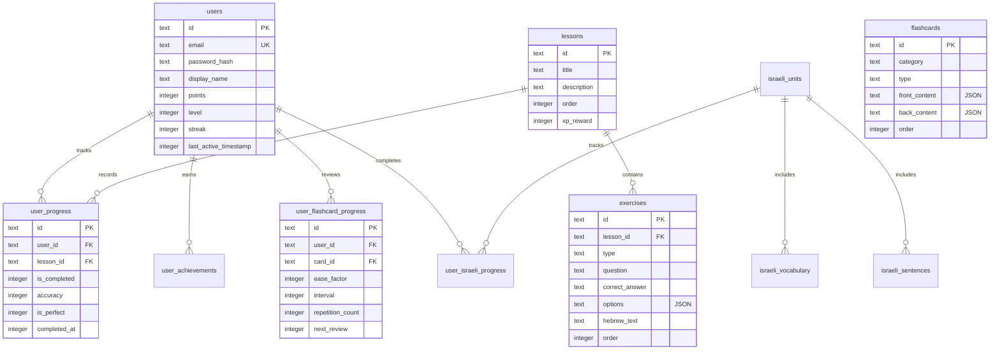

# TeoLingo v2

> Plataforma web de apoyo académico universitario para el aprendizaje de hebreo bíblico con rigor exegético y accesibilidad neurocognitiva (IME).

---

## 📖 1. Propósito y Fundamento Pedagógico

**TeoLingo v2** es una herramienta didáctica diseñada para complementar la cátedra universitaria de lenguas bíblicas (extensible en el futuro a griego koiné). Su enfoque central equilibra el rigor académico exigido en el análisis de textos sagrados con la accesibilidad para diversos perfiles neurocognitivos, disminuyendo la dependencia de la memorización mecánica descontextualizada.

### 🧠 El Enfoque Neuropedagógico (IME)
El proyecto implementa la metodología **IME (Inmersión Multisensorial Estructurada)**, la cual estimula múltiples canales sensoriales simultáneamente para consolidar el aprendizaje:
*   **Visual (V):** Uso de **Morfología Cromática** para hacer explícita la estructura de las palabras.
*   **Auditiva (A):** Audio nativo / síntesis de voz (TTS) para el recitado métrico y el entrenamiento rítmico, apoyando la segmentación temporal del lenguaje.
*   **Kinestésica (K) y Táctil (T):** Interacción física y manipulación activa en actividades como el trazado de caracteres y ordenación de palabras.

#### 🎨 Convención de Morfología Cromática (VAKT)
Para el análisis y decodificación de morfemas hebreos, la interfaz utiliza colores diferenciados para guiar el foco de atención del estudiante:
*   **Raíz / Shoresh (שֹׁרֶשׁ):** Gris oscuro (ancla visual estable que concentra el significado semántico).
*   **Prefijos (Preposiciones/Artículos):** Verde.
*   **Sufijos (Pronominales/Flexivos):** Azul.
*   **Marcadores Internos y Vocálicos:** Rojo o naranja suave.

#### 📊 Progresión de Bloom: De LOTS a HOTS
Para asegurar que la evaluación mida competencia hermenéutica y no solo retención temporal, TeoLingo estructura sus lecciones desde habilidades básicas de pensamiento (**LOTS** - *Lower Order Thinking Skills*) hacia las de orden superior (**HOTS** - *Higher Order Thinking Skills*):
1.  **LOTS (Recordar/Comprender):** Identificación del alfabeto, traducción de vocabulario por frecuencia, reconocimiento de paradigmas básicos.
2.  **HOTS (Analizar/Evaluar/Crear):** Clasificación morfológica y análisis gramatical exhaustivo (*noun-parsing*), justificación exegética de decisiones de traducción, y contextualización en textos ancla.

---

## 🛠️ 2. Stack Tecnológico

La aplicación está construida sobre un stack moderno optimizado para la velocidad de desarrollo, tipado estricto y despliegue rápido:

*   **Framework Principal:** Next.js 16 (App Router) con Turbopack.
*   **Entorno de Ejecución & Bun:** Bun (runtime, gestor de dependencias y ejecutor de pruebas).
*   **Persistencia de Datos:** Turso / libSQL (base de datos relacional Cloud compatible con SQLite).
*   **ORM:** Drizzle ORM (tipado nativo de esquemas SQL y migraciones eficientes).
*   **Gestión de Estado de Cliente:** Zustand (estado global ligero y persistido de autenticación e interfaz).
*   **Autenticación y Sesiones:** Tokens JWT firmados y verificados con la librería `jose`, gestionados en cookies de sesión seguras.
*   **Sistema de Estilos:** Vanilla CSS integrado con Tailwind CSS v4 para layouts flexibles y animaciones fluidas.
*   **Calidad & Formateo:** Biome (sustituto ultrarrápido de ESLint y Prettier).
*   **Pruebas de Integración:** Playwright (pruebas de extremo a extremo y validación visual automatizada).

---

## 📂 3. Arquitectura del Software (Screaming Architecture)

El proyecto sigue una estructura organizada por dominio y características (*features*), facilitando la escalabilidad del código:

```text
src/
├── app/                  # Enrutamiento, layouts, Server Actions y Route Handlers (Next.js)
├── components/           # Componentes visuales genéricos y utilidades visuales (Sidebar, AuthGuard, etc.)
├── domain/               # Entidades lógicas de negocio puras (ej. tipos y contratos de ejercicios)
├── features/             # Casos de uso e interfaces agrupados por feature vertical:
│   ├── auth/             # Registro, login y perfiles de usuario
│   ├── lessons/          # Casos de uso de lecciones, práctica de sustantivos, SRS y textos ancla
│   ├── israeli-mode/     # Unidades de audio y oraciones de inmersión en hebreo moderno
│   └── leaderboard/      # Cálculo y listado de tablas de clasificación
├── infrastructure/       # Capa de adaptadores externos y persistencia técnica:
│   ├── database/         # Instancia de conexión a Turso, esquemas de Drizzle y scripts de seeds
│   └── lib/              # Inicializadores de herramientas (ej. firma JWT en auth.ts)
├── lib/                  # Funciones de utilidades puras y reproductores de audio
└── store/                # Almacenes de Zustand para sincronización de sesión y UX en tiempo real
```

### 🔁 Flujo de Datos Capa a Capa
1.  La **Interfaz de Usuario (UI)** en `src/app/**` despacha interacciones de usuario llamando a **Server Actions** o **Route Handlers** locales.
2.  Las acciones y controladores delegan la validación de negocio en **Casos de Uso** (*Use Cases*) en `src/features/**/use-cases/*.ts`.
3.  Los casos de uso operan con tipado seguro en la base de datos a través de **Drizzle ORM** (`src/infrastructure/database/db.ts`).
4.  La base de datos retorna el resultado a los casos de uso, los cuales calculan puntos de experiencia (XP), logros o progreso de repaso (SRS), actualizan la sesión si aplica, y entregan un objeto limpio de vuelta a la UI para su renderizado inmediato.

---

## 🗄️ 4. Modelo y Arquitectura de Base de Datos

El motor de persistencia utiliza un esquema relacional unificado en SQLite/Turso definido de forma estricta en `src/infrastructure/database/schema.ts`.



### 📝 Resumen de Tablas del Sistema
*   **`users`**: Identidad del estudiante, puntos acumulados (XP), nivel global, racha de días activos y marcas de tiempo de última actividad.
*   **`user_progress`**: Historial de lecciones completadas por el estudiante con registro de precisión y puntaje.
*   **`lessons`**: Metadatos de la malla curricular organizada por lecciones secuenciales.
*   **`exercises`**: Reactivos de evaluación. Admite tipos `multiple-choice` (opciones múltiples), `translation` (traducción), `word-bank` (banco de palabras) y `noun-parsing` (análisis morfológico de sustantivos).
*   **`flashcards`**: Cartas de vocabulario asociadas a inmersión y práctica activa.
*   **`user_flashcard_progress`**: Registro de repetición espaciada (SRS) basado en el algoritmo SuperMemo-2 (`ease_factor`, `interval`, `repetition_count`, `next_review`).
*   **`achievements` & `user_achievements`**: Catálogo e histórico de logros desbloqueados.
*   **`anchor_texts`**: Textos originales anclados para inmersión profunda con morfología interactiva.
*   **`israeli_units`, `israeli_vocabulary`, `israeli_sentences`**: Unidades curriculares dedicadas al hebreo moderno interactivo.

---

## ⚡ 5. Puesta en Marcha Local

Sigue estos sencillos pasos para levantar el entorno de desarrollo local con Bun:

### 1. Clonar e Instalar Dependencias
Instala los paquetes del proyecto usando Bun de forma limpia:
```bash
bun install
```

### 2. Configurar Variables de Entorno
Crea un archivo `.env` en la raíz del proyecto. Debe contener el secreto de firma JWT y las credenciales de Turso (en local se puede usar una base de datos SQLite en archivo por defecto):
```env
JWT_SECRET=super_secret_local_test_key_for_teolingo
TURSO_DATABASE_URL=file:local.db
APP_URL=http://localhost:3000
NEXT_PUBLIC_APP_URL=http://localhost:3000
# Para producción/Staging, configura URL de Turso y Auth Token:
# TURSO_DATABASE_URL=libsql://tu-base-de-datos.turso.io
# TURSO_AUTH_TOKEN=tu-token-de-autorizacion
# APP_URL=https://tu-dominio.com
# NEXT_PUBLIC_APP_URL=https://tu-dominio.com
```

`APP_URL` se usa del lado servidor para construir enlaces sensibles (por ejemplo, recuperación de contraseña). En producción debe apuntar al dominio real y nunca a `localhost`.

### 3. Configurar e Inicializar la Base de Datos (Seed)
Alinea la estructura de la base de datos local con el esquema de Drizzle e inyecta todo el contenido curricular oficial de forma segura:
```bash
# Sincroniza la estructura de la base de datos
bun run db:push

# Inyecta las lecciones, ejercicios, audios e inmersión oficial sin borrar tu progreso acumulado
bun run db:seed:safe
```
*Nota opcional: Si deseas limpiar por completo el progreso de pruebas y reiniciar la base de datos de cero, ejecuta `bun run db:seed:reset`.*

### 4. Iniciar el Servidor de Desarrollo
Levanta la aplicación local:
```bash
bun dev
```
La aplicación estará disponible en [http://localhost:3000](http://localhost:3000).

---

## 📅 6. Roadmap Operativo y Plan Futuro

### ✅ Hitos Completados (Fases 0 - 3)
*   **Infraestructura:** Migración a Next.js App Router, integración nativa de Turso y Drizzle ORM.
*   **Módulos de Práctica:** Implementación de práctica interactiva por Frecuencia Bíblica, análisis morfológico de Sustantivos (*noun-parsing*), y repaso rápido.
*   **IME e Inmersión:** Mapeo de Textos Ancla interactivos, inmersión multisensorial del alfabeto y repaso espaciado (SRS Flashcards).
*   **Hebreo Moderno:** Módulo de Modo Israelí (ILC) con oraciones estructuradas y audio.
*   **Calidad & QA:** Estabilización de dependencias, tipado estricto por modalidad de ejercicio (Unión Discriminada) y configuración del linter Biome.
*   **Currículo Hebreo 1 y 2:** Cobertura de preposiciones inseparables, adjetivos y concordancia, pronombres, conjugación verbal básica (Qal perfecto/imperfecto) y sufijos verbales.

### 🛠️ Fase Actual en Progreso: Aseguramiento Técnico
*   [x] Cobertura y estabilización de pruebas automatizadas E2E de flujos críticos con Playwright.
*   [x] Normalización estilística con formateador y linter Biome omitiendo directorios del sistema.
*   [ ] Instrumentación de observabilidad y registro básico de errores en el cliente y API.

### 🔮 Plan Estratégico Futuro (12 - 24 meses)
*   **Cohorte & Tablero Docente:** Diseño de una interfaz administrativa para docentes (trazabilidad de progreso por curso, alertas de rezago neurocognitivo, exportación de rúbricas).
*   **Ampliación Curricular:** Banco de ejercicios expandido y auditado por un panel docente independiente para la inclusión de sintaxis intermedia y el griego koiné.
*   **Evaluación Autentica Multimodal:** Implementación de rubricas de evaluación basadas en el marco didáctico de diseño inverso (hitos GRASPS, defensas orales cortas grabadas).

---

## 🧼 7. Historial de Auditoría y Limpieza

Para asegurar la robustez del repositorio, se aplicó un protocolo de limpieza que eliminó código huérfano y redujo el tamaño del proyecto:
*   **Dependencias Purificadas:** Se removieron los paquetes `@tanstack/react-query`, `pdf-parse` y `pdf2json` del gestor al no tener uso en producción, eliminando los wrappers innecesarios en el layout.
*   **Eliminación de Scripts Huérfanos:** Se purgaron 8 scripts `.cjs`/`.ts` obsoletos de la raíz (tales como `clean-db.ts`, `fix-imports.cjs`, `query-lessons.cjs`, etc.) y el archivo temporal `toc.txt`.
*   **Consolidación de Código de Origen:** Eliminación del middleware proxy inerte `src/proxy.ts` y de la migración manual en desuso `add-quiz-attempts.ts`.
*   **Centralización Documental:** Se eliminaron las guías dispersas en la carpeta `docs/` para unificar el conocimiento técnico y didáctico en este archivo README maestro, salvaguardando las referencias bibliográficas y PDFs de consulta en `docs/referencias/`.
