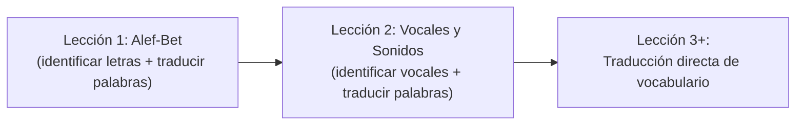
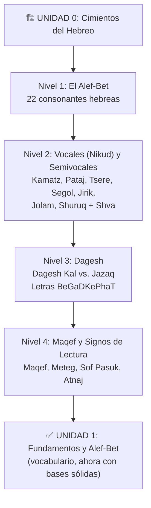

# Análisis de Factibilidad: Nivel Introductorio (Pre-Unidad 1)

## Problema Actual

Tu observación es **totalmente acertada**. El flujo actual de Teolingo tiene un salto pedagógico importante:



> [!WARNING]
> Las lecciones 1 y 2 **mezclan** el aprendizaje del sistema de escritura con traducción de palabras. Un estudiante nuevo debe simultáneamente reconocer letras *y* traducir palabras como "Ab" (padre) o "Shalom" (paz), lo cual genera sobrecarga cognitiva — exactamente lo que tu metodología IME busca evitar.

---

## Estructura Actual (Unidad 1)

| Lección | Título | Contenido |
|---------|--------|-----------|
| 1 | El Alfabeto (Alef-Bet) | Mezcla: identificar א,ב,ג,ד,ה + traducir Ab, Eretz, Ben, Adam, Ishá |
| 2 | Vocales y Sonidos | Mezcla: identificar vocales (Kamatz, Tsere) + traducir Shalom, Berit, Torá |
| 3 | Palabras Básicas | Traducción pura: Elohim, Melek, Kadosh... |
| 4 | Verbos Comunes I | Traducción: Amar, Bará, Halak... |
| 5 | La Familia | Traducción: Em, Bat, Aj... |
| 6 | El Santuario | Traducción: Heijal, Mizbeaj... |
| 7 | Animales de la Biblia | Traducción: Keléb, Aryé... |
| 8 | Naturaleza y Creación | Traducción: Shamayim, Kokab... |

---

## Propuesta: Unidad 0 "Cimientos del Hebreo" (4 niveles)

Insertar una **Unidad 0** antes de la actual Unidad 1, enfocada exclusivamente en el sistema de escritura sin exigir traducción de vocabulario:



### Nivel 1: El Alef-Bet (Alfabeto)
- **Objetivo**: Reconocer y nombrar las 22 consonantes
- **Ejercicios**: Selección múltiple (identificar letras), emparejar letra con nombre, reconocer letra por sonido
- **Agrupación sugerida**: Por forma similar (ב/כ, ד/ר, ה/ח, ו/ז, etc.)
- **Ya tienes**: Tabla `alphabet` con las 22 letras y [GetAlphabetUseCase](file:///c:/dev/teolingo-v2/src/features/lessons/use-case.ts#626-641)

### Nivel 2: Vocales (Nikud) y Semivocales
- **Objetivo**: Reconocer los signos vocálicos y su sonido
- **Contenido**: Las 5 vocales largas, 5 cortas, ultra-cortas (Jataf), y Shva
- **Ejercicios**: Identificar qué sonido produce בָּ vs בִּ vs בֵּ (ya tienes este tipo en lección 2)

### Nivel 3: Dagesh
- **Objetivo**: Entender la diferencia entre Dagesh Kal y Dagesh Jazaq
- **Contenido**: Las 6 letras BeGaDKePhaT (בגדכפת), cómo el dagesh cambia su pronunciación
- **Ejercicios**: ¿Cómo suena ב vs בּ? ¿Cuál es "V" y cuál es "B"?

### Nivel 4: Maqef y Signos de Lectura
- **Objetivo**: Reconocer los signos de puntuación y cantilación básica
- **Contenido**: Maqef (guión), Meteg, Sof Pasuk (fin de versículo), Atnaj (pausa mayor)
- **Ejercicios**: Identificar signos en contexto, entender por qué las palabras se unen con maqef

---

## Factibilidad Técnica

### ✅ Lo que ya tienes y facilita la implementación

| Recurso | Estado |
|---------|--------|
| Tabla `alphabet` con 22 letras | ✅ Existe |
| [GetAlphabetUseCase](file:///c:/dev/teolingo-v2/src/features/lessons/use-case.ts#626-641) | ✅ Existe |
| Sistema de ejercicios (`exercises` table) | ✅ Soporta `multiple-choice` y `translation` |
| Sistema de lecciones con `order` | ✅ Flexible, solo re-numerar |
| Sistema de progresión (lock/unlock) | ✅ Ya funciona por orden |
| Tipos de ejercicio existentes | ✅ `multiple-choice` perfecto para esto |

### ⚠️ Lo que necesitarías cambiar

| Cambio | Complejidad | Detalle |
|--------|-------------|---------|
| Renumerar lecciones existentes | 🟢 Baja | Mover órdenes: lesson 1→5, 2→6, etc. |
| Crear 4 nuevas lecciones + ejercicios | 🟡 Media | ~40 ejercicios nuevos en el seed |
| Ajustar unidades en [LearnClientContent.tsx](file:///c:/dev/teolingo-v2/src/app/learn/LearnClientContent.tsx) | 🟢 Baja | Cambiar los rangos de filtro (actualmente hardcoded) |
| Agregar nueva Unidad 0 al renderizado | 🟢 Baja | Un nuevo [renderUnit()](file:///c:/dev/teolingo-v2/src/app/learn/LearnClientContent.tsx#32-94) con color distinto |
| No se necesitan nuevas tablas | ✅ | Todo cabe en el schema actual |

### 🔴 Impacto en usuarios existentes
- Si ya hay usuarios con progreso, al re-numerar lecciones su `userProgress` seguiría ligado a `lessonId` (UUID), **no al orden**, así que **no se rompe el progreso existente**.
- Solo cambiaría el orden visual.

---

## Veredicto

> [!TIP]
> **Es 100% factible y pedagógicamente necesario.** Tu intuición está alineada con la metodología IME que ya defines en tu documento: enseñanza "ladrillo a ladrillo", reducción de carga cognitiva, progresión del sistema de escritura antes de exigir comprensión de vocabulario.

### Beneficios clave
1. **Elimina el "choque"** de ir directo a traducción sin dominar el sistema de escritura
2. **Alinea con la IME**: Progresión Orton-Gillingham (sistemática, acumulativa)
3. **Reduce carga cognitiva**: El estudiante aprende UNA cosa a la vez
4. **Reutiliza infraestructura existente**: No requiere nuevas tablas ni cambios en el schema
5. **No rompe progreso**: Los `lessonId` son UUIDs, independientes del orden

### Flujo propuesto completo

```
Unidad 0: Cimientos del Hebreo (NUEVA)
  └── Lección 1: El Alef-Bet (consonantes)
  └── Lección 2: Vocales y Semivocales (nikud)
  └── Lección 3: Dagesh (kal/jazaq + BeGaDKePhaT)
  └── Lección 4: Maqef y Signos de Lectura

Unidad 1: Fundamentos y Vocabulario (ACTUAL, renumerada)
  └── Lección 5: El Alfabeto en Contexto (actual L1, ahora aplica letras a palabras)
  └── Lección 6: Vocales en Contexto (actual L2, ahora aplica vocales a palabras)
  └── ... (lecciones 3-8 actuales → 7-12)

Unidad 2: Gramática y Vocabulario (ACTUAL, renumerada)
  └── ... (lecciones 9-13 → 13-17)

Unidad 3: Gramática Intermedia (ACTUAL, renumerada)
  └── ...
```

---

¿Quieres que proceda a implementar esta Unidad 0 con los ejercicios y los cambios necesarios en el seed y el componente de visualización?
